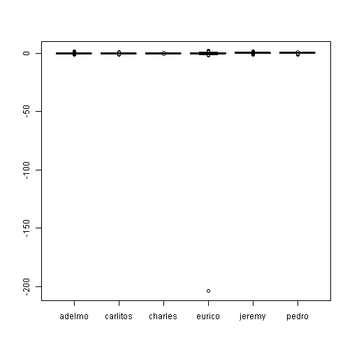
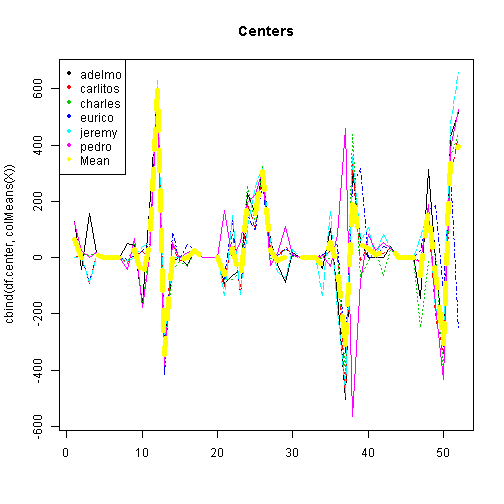
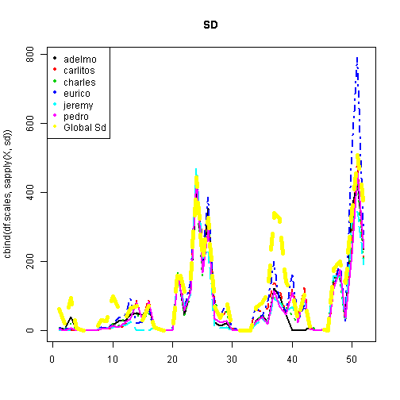
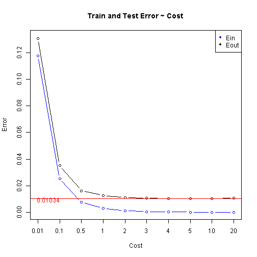
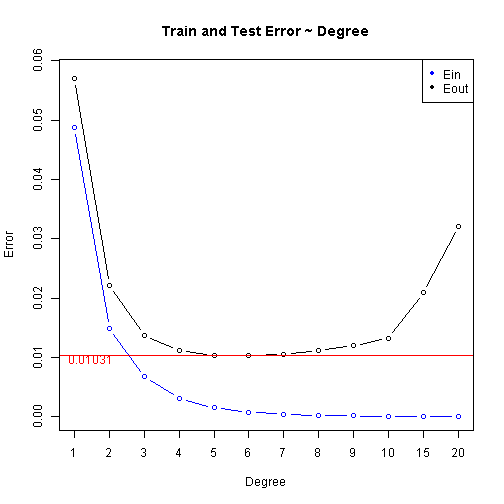
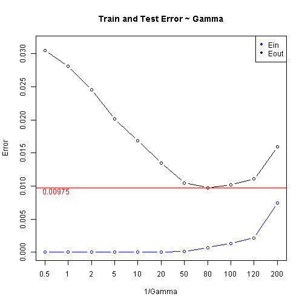
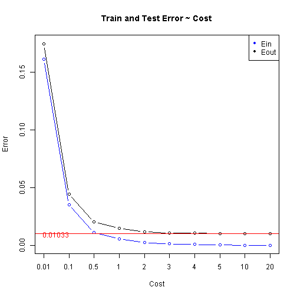

Prediction Assignment Writeup
===============================

## Import the data


```r
training.data = read.csv('pml-training.csv', header=T, row.names=1)
test.data = read.csv('pml-testing.csv', header=T, row.names=1)
```

One observation is there are quite a few columns containing `NA` . Fortunately, the same columns
remain `NA` in the test data, we simply remove all them.


```r
ind.na = which(sapply(test.data, function(x) all(is.na(x))))
training.data = training.data[ -ind.na ]
test.data = test.data[ -ind.na ]
```

## Check and remove outlier


```r
box.check = function(XX, uu, fn, ...) {
    pdf(fn)
    on.exit(dev.off())
    for(i in colnames(XX)) {
        boxplot(XX[,i] ~ uu , main=i, ...)
    }
}
```

First 6 columns are not measurements, the last column is class, we only need to check those measurements.


```r
box.check(training.data[c(-(1:6),-59)], training.data$user_name, 'var.mean.pdf')
```

We select one plot here.

```r
boxplot( gyros_dumbbell_x ~ user_name, data=training.data )
```

 

By manually eyeball checking of all the plots for all variables, we found the following ones.

```r
# gyros_dumbbell_x, eurico, <= -200
rownames(subset(training.data, user_name=='eurico' & (gyros_dumbbell_x <= -200)))
```

```
## [1] "5373"
```

```r
# gyros_dumbbell_y, eurico, >50
rownames(subset(training.data, user_name=='eurico' & (gyros_dumbbell_y > 50)))
```

```
## [1] "5373"
```

```r
# gyros_dumbbell_z, eurico, >300
rownames(subset(training.data, user_name=='eurico' & (gyros_dumbbell_z > 300)))
```

```
## [1] "5373"
```

```r
# accel_dumbbell_x, eurico, <-400
rownames(subset(training.data, user_name=='eurico' & (accel_dumbbell_x < -400)))
```

```
## [1] "5373"
```

```r
# total_accel_forearm, eurico, > 100
rownames(subset(training.data, user_name=='eurico' & (total_accel_forearm > 100)))
```

```
## [1] "5373"
```

```r
# gyros_forearm_x, eurico, < -20
rownames(subset(training.data, user_name=='eurico' & (gyros_forearm_x <  -20)))
```

```
## [1] "5373"
```

```r
# gyros_forearm_y, eurico, > 300
rownames(subset(training.data, user_name=='eurico' & (gyros_forearm_y >  300)))
```

```
## [1] "5373"
```

```r
# gyros_forearm_z, eurico, > 200
rownames(subset(training.data, user_name=='eurico' & (gyros_forearm_z >  200)))
```

```
## [1] "5373"
```

```r
# accel_forearm_y, eurico, > 700
rownames(subset(training.data, user_name=='eurico' & (accel_forearm_y >  700)))
```

```
## [1] "5373"
```

```r
# accel_forearm_z, eurico, <  -300 
rownames(subset(training.data, user_name=='eurico' & (accel_forearm_z < -300)))
```

```
## [1] "5373"
```

```r
# magnet_dumbbell_y, carlitos, < -3000
rownames(subset(training.data, user_name=='carlitos' & (magnet_dumbbell_y < -3000)))
```

```
## [1] "9274"
```

They all point to 2 outliers.  We now remove the two outliers.

```r
X = training.data[ -c(5373, 9274), -c(1:6, NCOL(training.data))]
Y = training.data[ -c(5373, 9274), NCOL(training.data)]
username = training.data$user_name[ -c(5373, 9274) ]
```

## Normalization

Usually, we normalize to mean of whole data set. However the test data have exactly same
user as the training data. The `username` is then contain a lot of information as a usable feature.
We don't even need an ANOVA to test that.


```r
centers = by(X, username, colMeans)
scales = by(X, username, function(x) sapply(x, sd))
scales.inv = lapply(scales, function(x) ifelse(x==0, 0 ,1/x))
pred.vars = colnames(X)
```

The centers and standard deviation are as following.

```r
df.center = do.call('cbind', centers)
matplot(cbind(df.center, colMeans(X)), type='l', col=c(1:6,7), lwd=c(rep(1,6),5), main='Centers')
legend('topleft', c(colnames(df.center),'Mean'), col=1:7, pch=20)
```

 

```r
df.scales = do.call('cbind', scales)
matplot(cbind(df.scales, sapply(X,sd)), type='l', col=1:7, main='SD', lwd=c(rep(2,6),5))
legend('topleft', c(colnames(df.scales),'Global Sd'), col=1:7, pch=20)
```

 

We need to be careful there are some feature is actually not available for some user.


```r
# some one, some variable don't even have a change
print(sapply(scales, min))
```

```
##     adelmo   carlitos    charles     eurico     jeremy      pedro 
## 0.00000000 0.02157440 0.03431104 0.08869801 0.00000000 0.02885950
```

```r
print(which(df.scales == 0, arr.ind=T))
```

```
##               row col
## roll_forearm   40   1
## pitch_forearm  41   1
## yaw_forearm    42   1
## roll_arm       14   5
## pitch_arm      15   5
## yaw_arm        16   5
```

```r
# for adelmo, "roll_forearm"  "pitch_forearm" "yaw_forearm" are actually not effective
print(rownames(df.scales)[40:42])
```

```
## [1] "roll_forearm"  "pitch_forearm" "yaw_forearm"
```

```r
# for jeremy, "roll_arm"  "pitch_arm" "yaw_arm" are actually not effective
print(rownames(df.scales)[14:16])
```

```
## [1] "roll_arm"  "pitch_arm" "yaw_arm"
```

After normalize, we check manually if everything looks fine.

```r
my.scale = function(X, users, w = scales.inv) {
    X = as.matrix(X)
    for(i in levels(users)) {
        ind = which(users==i)
        X[ind, ] = t((t(X[ind,]) - centers[[i]]) * w[[i]])
    }
    X
}
X0 = my.scale(X, username, scales.inv)
```


```r
box.check(X0, username, 'X0.var.mean.pdf')
```

## Start fit a model

We will use support vector machine in the following, so we load `e1071` package.


```r
library(caret)
```

```
## Loading required package: lattice
## Loading required package: ggplot2
## Find out what's changed in ggplot2 with
## news(Version == "1.0.0", package = "ggplot2")
```

```r
library(e1071)
```

As we want to use `user_name` column, the nature idea is the train for each user a `svm` model,
and combine them as a big one.

We want to point out because of some column have 0 variance for a user (see last section), the scaling will
met problem, in the following function, we remove those contant column before training.


```r
train.mixed.model = function(X, Y, username, cost=3, degree=6, gamma=1/80) {
    mixed.model = list()
    err.tot = 0
    for(i in levels(username)) {
        ind = which(username==i)
        # X are un-scaled data
        select.vars = which(sapply(X[ind,], function(x) sd(x))!=0)
        mod = svm(X[ind, select.vars], Y[ind], 
                   type='C-classification', 
                   kernel='polynomial', 
                   cost = cost, 
                   degree=degree, 
                   gamma = gamma, 
                   coef0=1, 
                   scale=TRUE)
        err = sum(mod$fitted!=Y[ind])
        err.tot = err.tot+err
        # cat(sprintf('User %s Ein=%s\n', i,  err/length(ind)))
        mixed.model[[ i ]] = list(mod=mod, select.vars=select.vars)
    }
    mixed.model$Ein = err.tot/NROW(X)
    class(mixed.model) <- append(class(mixed.model),'my.mixed.model')
    mixed.model
}
```

Of course, as `user_name` is used in training, for prediction, the data must have a username and must belong
to the known names in the training data. The prediction function is as following.


```r
predict.mixed.model = function(mod, X, users) {
    if (missing(users)) {
        users = X$'user_name'
        if (is.null(users)) stop('Lack users!')
    }
    pred = character(NROW(X))
    for(i in levels(users)) {
        ind = which(users==i)
        pred[ind] = as.character(predict(mod[[i]]$mod, X[ind, names(mod[[i]]$select.vars), drop=FALSE]))
    }
    pred
}
```


## Finding optimal parameters

### Search a trend for cost.


```r
Niter = 10
search.grid = c(0.01, 0.1, 0.5, 1, 2, 3, 4, 5, 10, 20)
df.cost.Ein = matrix(NA, Niter, length(search.grid), dimnames=list(1:Niter, c(as.character(search.grid))))
df.cost.Eout = matrix(NA, Niter, length(search.grid), dimnames=list(1:Niter, c(as.character(search.grid))))
for(i in 1:Niter) {
    ind = createDataPartition(Y, p = 0.5, list=F)
    for(j in search.grid) {
        mod.tmp = train.mixed.model(X[ind,], Y[ind ], username[ ind ] , j)
        Ein = mod.tmp$Ein
        Eout = sum(predict.mixed.model(mod.tmp, X[-ind,], username[ -ind ] )!=Y[-ind])/(NROW(X)-length(ind))
        df.cost.Ein[i, as.character(j)] = Ein
        df.cost.Eout[i, as.character(j)] = Eout
        #cat(sprintf('Iter %s, Cost= %s, Ein= %s, Eout = %s\n', i, j, Ein, Eout))
    }
}
```


```r
EEin = colMeans(df.cost.Ein) 
EEout = colMeans(df.cost.Eout) 
plot(EEout, ylim=c(0,max(EEout)+0.001), axes=F, main='Train and Test Error ~ Cost', col='black', type='b', xlab='Cost', ylab='Error')
points(EEin, col='blue', type='b')
axis(2)
axis(1, at=seq_along(search.grid), labels=search.grid)
legend('topright', c('Ein','Eout'), col=c('blue','black'), pch=20)
abline(h=min(EEout), col='red')
text(1.5, min(EEout)-0.0005, round(min(EEout),5), xpd=NA, col='red')
box()
```

 

We choose `cost=3` .

### Search a trend for Degree.


```r
search.grid = c(1:10,15,20)
df.Degree.Ein = matrix(NA, Niter, length(search.grid), dimnames=list(1:Niter, c(as.character(search.grid))))
df.Degree.Eout = matrix(NA, Niter, length(search.grid), dimnames=list(1:Niter, c(as.character(search.grid))))
for(i in 1:Niter) {
    ind = createDataPartition(Y, p = 0.5, list=F)
    for(j in search.grid) {
        mod.tmp = train.mixed.model(X[ind,], Y[ind ], username[ ind ] , cost=3, degree=j)
        Ein = mod.tmp$Ein
        Eout = sum(predict.mixed.model(mod.tmp, X[-ind,], username[ -ind ] )!=Y[-ind])/(NROW(X)-length(ind))
        df.Degree.Ein[i, as.character(j)] = Ein
        df.Degree.Eout[i, as.character(j)] = Eout
        # cat(sprintf('Iter %s, Degree= %s, Ein= %s, Eout = %s\n', i, j, Ein, Eout))
    }
}
```

 

###  Search a trend for gamma.


```r
search.grid = 1/c(0.5, 1, 2, 5, 10, 20, 50, 80, 100, 120, 200)
df.Gamma.Ein = matrix(NA, Niter, length(search.grid), dimnames=list(1:Niter, c(as.character(search.grid))))
df.Gamma.Eout = matrix(NA, Niter, length(search.grid), dimnames=list(1:Niter, c(as.character(search.grid))))
for(i in 1:Niter) {
    ind = createDataPartition(Y, p = 0.5, list=F)
    for(j in search.grid) {
        mod.tmp = train.mixed.model(X[ind,], Y[ind ], username[ ind ] , cost=3, degree=6, gamma=j)
        Ein = mod.tmp$Ein
        Eout = sum(predict.mixed.model(mod.tmp, X[-ind,], username[ -ind ] )!=Y[-ind])/(NROW(X)-length(ind))
        df.Gamma.Ein[i, as.character(j)] = Ein
        df.Gamma.Eout[i, as.character(j)] = Eout
        # cat(sprintf('Iter %s, Gamma= %s, Ein= %s, Eout = %s\n', i, j, Ein, Eout))
    }
}
```

 


### Choose gamma=1/80 and Degree=5, do another search


```r
search.grid = c(0.01, 0.1, 0.5, 1, 2, 3, 4, 5, 10, 20)
df.cost.Ein = matrix(NA, Niter, length(search.grid), dimnames=list(1:Niter, c(as.character(search.grid))))
df.cost.Eout = matrix(NA, Niter, length(search.grid), dimnames=list(1:Niter, c(as.character(search.grid))))
for(i in 1:Niter) {
    ind = createDataPartition(Y, p = 0.5, list=F)
    for(j in search.grid) {
        mod.tmp = train.mixed.model(X[ind,], Y[ind ], username[ ind ] , cost=j, degree=5, gamma=1/80)
        Ein = mod.tmp$Ein
        Eout = sum(predict.mixed.model(mod.tmp, X[-ind,], username[ -ind ] )!=Y[-ind])/(NROW(X)-length(ind))
        df.cost.Ein[i, as.character(j)] = Ein
        df.cost.Eout[i, as.character(j)] = Eout
        #cat(sprintf('Iter %s, Cost= %s, Ein= %s, Eout = %s\n', i, j, Ein, Eout))
    }
}
```

 

## Fit the final model using the optimal parameters


```r
final.model = train.mixed.model(X, Y, username, cost=3, degree=6, gamma=1/80)
final.model$Ein
```

```
## [1] 0.0004077472
```

```r
answers = predict.mixed.model(final.model, test.data)
answers
```

```
##  [1] "B" "A" "B" "A" "A" "E" "D" "B" "A" "A" "B" "C" "B" "A" "E" "E" "A"
## [18] "B" "B" "B"
```

And these are the answers to the Assignments.

